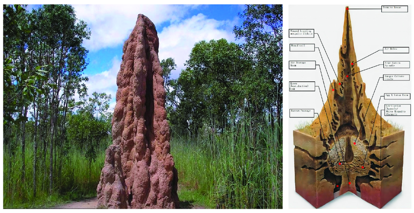

+++
title = "Creativity and AI: Brainard's Introduction and Section 2.1"
outputs = ["Reveal"]
[logo]
src = "github-logo.png"
[reveal_hugo]
custom_theme = "reveal-hugo/themes/robot-lung.css"
margin = 0.2
separator = "##"
+++

# The Curious Case of Uncurious Creation 
## *Lindsay Brainard*

> Can contemporary forms of artificial intelligence be creative?

---

## Human's place in a world with highly productive AI

- What is the place of humans in a world where AI might be able to do any task a human could do, but better?
- Would the idea (or fact) that an AI creates art or science make us not want to create those things since the AI can do them faster or better?
- What if AI takes not only our jobs but our motivation to create?

{}
I have never heard this argument about AI. The idea that a super-powerful AI might demotivate us is fascinating. I can think of examples where an audience member might want a violin soloist performing a challenging piece of music and think, "I could never do that." They wouldn't be motivated to create by the performance but scared away by the sheer incomprehensibility of how the performance was achieved. 

Examples of change because of technology: photography vs painting, musical recording vs live performance, etc.

What's the purpose of painting when photography can recreate the world exactly as it is? After photography, painting became more abstract and expressive. Photography also influenced painters by allowing them to capture a moment in time and paint from that.

Regarding motivation, we might draw a parallel to physical activities. Modern transportation is "better" than walking in terms of pure efficiency, yet millions of people choose to hike for pleasure, challenge, and personal growth. Similarly, the existence of calculators hasn't eliminated our desire to understand mathematics - if anything, they've allowed us to explore more complex mathematical concepts by handling the routine calculations.
{}

---

### Creative?

{}
Arguments for creativity:

- The mounds exhibit emergent complexity beyond individual termite behavior
- Each mound is unique, showing novel solutions to environmental challenges
- The structures adapt to local conditions in unpredictable ways

Arguments against:

- Termites follow genetically programmed rules rather than making conscious choices
- The variations could be viewed as random rather than truly creative
- The process lacks intentionality typically associated with creativity

The key question hinges on whether creativity requires consciousness/intention or if emergent complexity and novelty are sufficient criteria.
{}

---

## Common uses of the term creativity

- "the capacity to generate ideas or artifacts that are both new and positively valuable" - Margaret Boden.
	- This definition reflects the common useable of creativity in that it speaks of both novelty and value.
- But Brainard points out, quoting Gaut, that this definition is insufficient to distinguish humans' creativity from animals.
- Gaut describes an oyster that produces a pearl or a tree that produces a distinctive canopy of leaves. 
- Brainard wants to distinguish creativity from the output of artificial intelligence systems by going beyond the description of it as only novel or valuable.

{}
- There are philosophers though that do think nature and animals can be creative. 
- A few more examples I can think of are snowflakes, where each is unique, but snowflakes have no inherent value.
- I'm also thinking about the definition of value in this context. Does it refer to economic or other values not tied to the monetary system? Something like a family heirloom that isn't worth anything to sell but has importance, or a work of art where the value isn't intrinsic to the object, what it can do, but how people look at the object.

{}

---

## Figuring out the unique sense of creativity

- According to Boden:
  - Something might be called creative if it's a tool used in a creative process, such as a paintbrush.
- Generative AI is similar to a paintbrush in that it can be a tool for creative work and create new and valuable things.
- What makes something truly creative is missing from the descriptor of novel or valuable.

{}
- I agree with Brainard that a paintbrush is a creative tool; this is a widespread usage. A violin would also be considered a creative tool for violinists, without which they could not be creative.
- It would be interesting to ask the students what the difference between a violin and an LLM is and have them try to figure it out. Are both just tools?
- On her assertion that an LLM can create something novel, I have heard many arguments against this idea based on the idea that these systems regurgitate what they already know. Brainard goes on to explain that they can create novel output, though the novelness of the output doesn't alone grant it the label of creative.
{}

---

> AI models can clearly produce new and valuable things, and they can clearly be used as tools in creative work. The sense of “creativity” that makes the question philosophically interesting – and that motivates the existential anxiety I described in the introduction – must be a richer sense, something along the lines of what Gaut alludes to in the passage above.